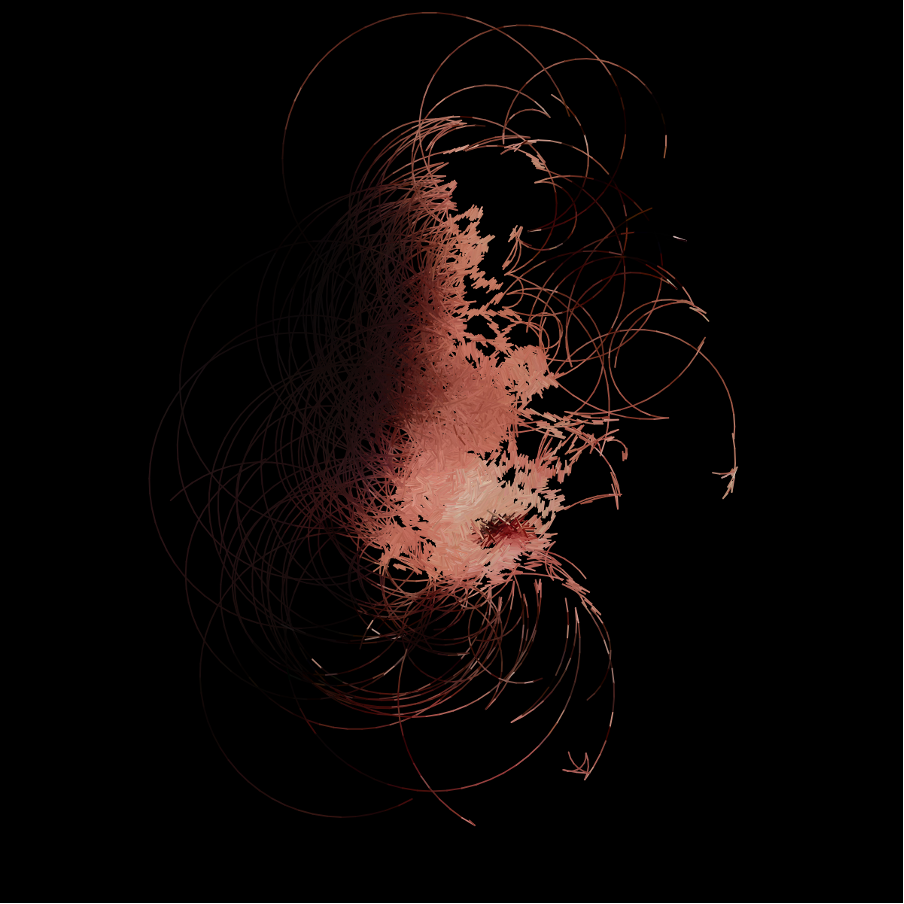
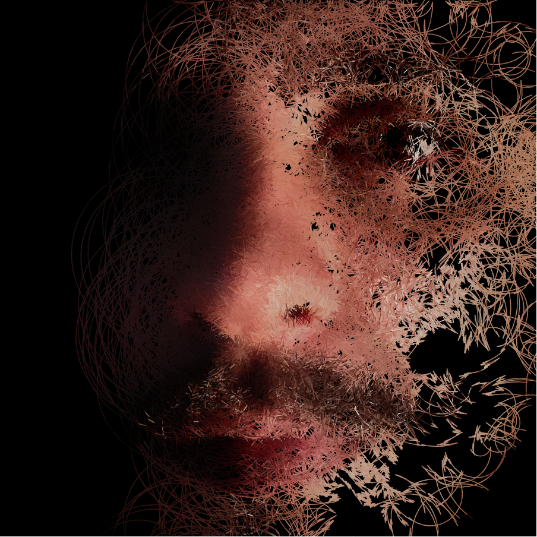
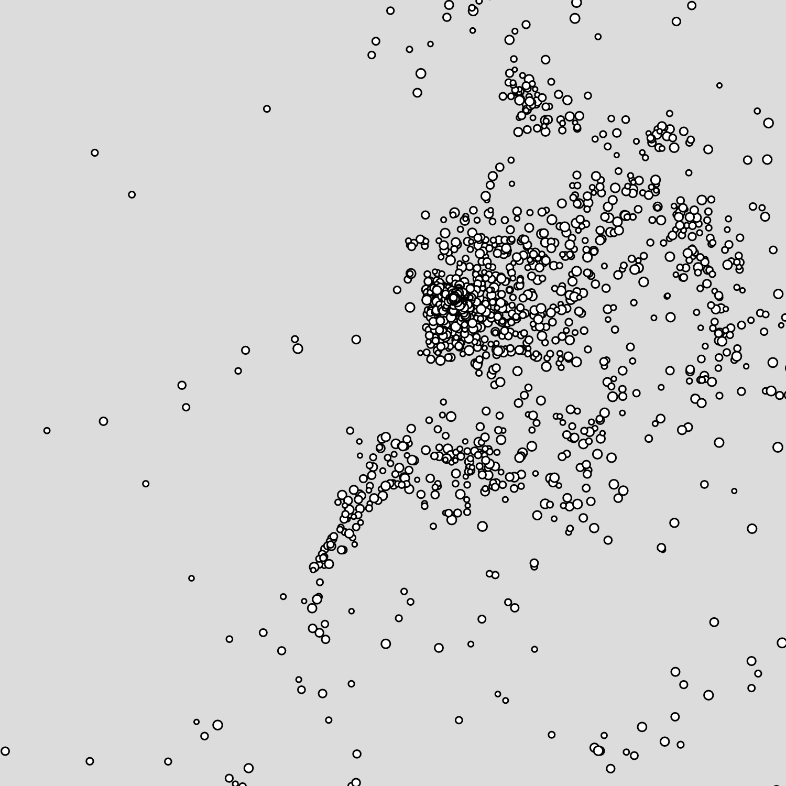

# lzha0267_9103_tut6

My first repository for IDEA9103  

### Part 1: Imaging Technique Inspiration
The example creates an elegant visual effect using particles moving like **circular random walkers**. I am inspired primarily by how **particle system** combines **circular motion** with **brightness detection**. As particles move in smooth, circular paths, they dynamically react to the brightness of the underlying image. If the brightness is relatively high, the particles bounce off, changing direction and speed accordingly, adding depth and complexity to the artwork.  

This technique aligns with the assignment requirements, as the particle system rebuilds the image by **dynamically weaving it** together in an interesting and graceful way, forming a complete picture through motion.  

---
### Part 2: Coding Technique Exploration
To achieve the **circular random walkers** technique, I explored the **particle system** which is a technique that manages many small particles, each with properties like **position, velocity, and acceleration**. These particles move dynamically across the canvas, responding to **forces** such as gravity, wind, or, in this case, image brightness. The technique involves updating the position of each particle in every frame based on its velocity, while also adjusting speed and direction according to the forces. The particle system helps in creating **complex, evolving patterns** while offering flexibility in adjusting particle movement, behaviour, and interaction with the environment.  

Here is the example implementation of [Particle System](https://editor.p5js.org/codingtrain/sketches/D4ty3DgZB).  

